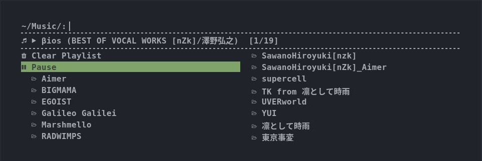
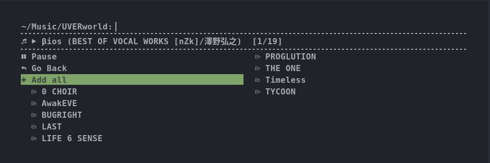
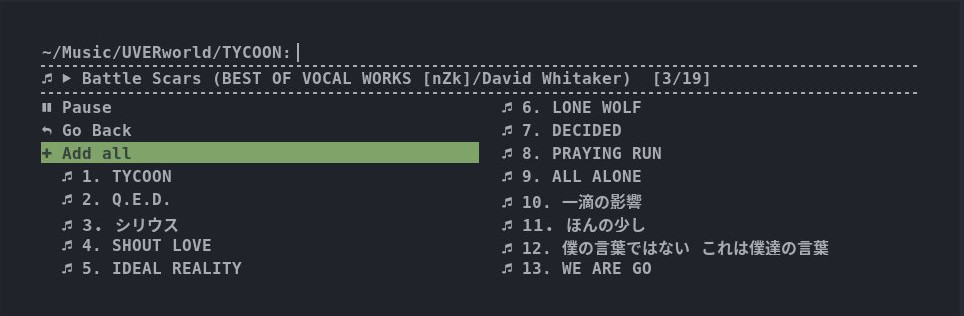

# rofi-mpd-client

Simple MPD client powered by Rofi & Python 3

## Requirements

  * Python 3.6 ~
  * python-musicpd (MPD client for Python 3)
  * Rofi
  * (Icon Font)

## Features

  * Display current song
  * Play/Pause
  * Edit playlist(add songs and clear)
  * Simple filer using Rofi

## Screenshots

  

  
